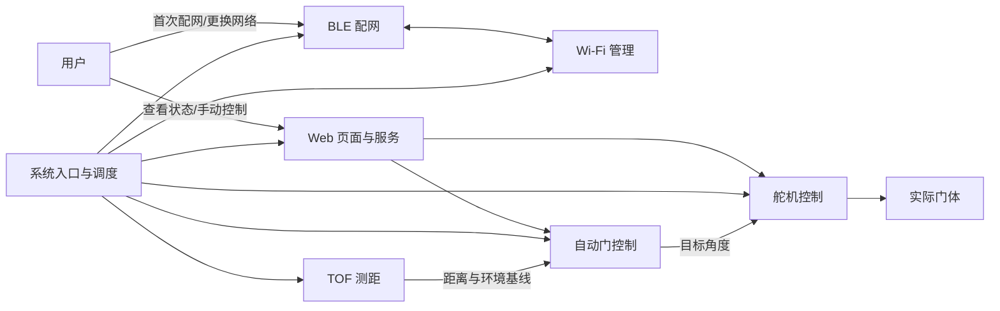

# 系统入口与调度

> 对应代码：`AutoDoorBLE.ino`、`src/app/AutoDoorApp.h`、`src/app/AutoDoorApp.cpp`
> 重建等级：L4（结构与行为重建）

<!-- ==================== 第一部分：给人阅读 ==================== -->

## 总：模块概要（给人阅读）

本模块是程序入口和总调度中心。它本身不实现测距、联网或门控算法，而是把这些模块创建出来，按照依赖关系完成初始化，并在 Arduino 主循环中持续推动它们运行。

### 系统全景



这张图展示了系统的主要分工：TOF 提供环境信息，自动门控制模块做出决策，舵机控制负责执行；BLE 和 Wi-Fi 解决设备联网，Web 页面与服务为用户提供日常操作入口。系统入口位于中间，负责让所有模块按正确顺序协同工作。

### 从上电到运行

```text
ESP32 上电
  → 初始化串口和舵机
  → 初始化 TOF200C（仅 I²C 初始化）
  → 启动 Wi-Fi、BLE 和 Web 服务
  → 标定环境基线（5 秒超时，超时以最大量程兜底）
  → 启动门控
  → 有可用 Wi-Fi：进入 Running
  → 没有可用 Wi-Fi：停留在 Configuring，等待 BLE 配网
```

TOF 初始化失败时，系统会停止后续启动，避免在无法可靠测距的情况下驱动门体。Wi-Fi 尚未连接时，设备保持配网状态；连接成功后才开始更新自动门决策。

### 主循环在做什么

设备进入持续运行后，入口模块会反复更新 Wi-Fi、舵机和 BLE，并处理新的配网数据。只有系统进入 `Running` 后，自动门控制器才会读取距离并推进门状态。BLE 在正常运行期间仍然保留，因此以后更换路由器时不需要重新烧录程序。

入口模块只负责生命周期和调度。传感器怎样测距、怎样判断有人、网页有哪些路由，分别由对应功能模块负责。

---

<!-- ============== 第二部分：给 AI 和开发者阅读 ============== -->

## 分：代码重建规格（给 AI 或修改代码的开发者阅读）

### 1. 文件映射

- `AutoDoorBLE.ino`：Arduino 入口，拥有全局变量 `AutoDoorApp app`。
- `src/app/AutoDoorApp.h`：声明应用类及其拥有的全部模块对象。
- `src/app/AutoDoorApp.cpp`：实现初始化、循环调度、配网处理和运行状态切换。

### 2. 依赖

`src/app/AutoDoorApp.h` 使用相对路径直接包含 `../network/BleManager.h`、`../control/DoorController.h`、`../devices/ServoControl.h`、`../devices/TofSensor.h`、`../web/WebServerManager.h`、`../network/WifiManager.h`。实现文件额外依赖 `Arduino.h`、`../config/Config.h`。

### 3. 类型和类结构

`AutoDoorApp` 的公开方法仅有 `void begin()`、`void update()`。

私有枚举 `State` 按顺序包含 `Configuring`、`Running`。私有方法为 `handleWiFiConfig()`、`enterRunningState()`。

私有成员按逻辑拥有：`ServoControl servo_`、`TofSensor tofSensor_`、`BleManager ble_`、`DoorController door_`、`WifiManager wifi_`、`WebServerManager web_`；`State state_` 就地初始化为 `Configuring`。

### 4. Arduino 入口

```cpp
#include "src/app/AutoDoorApp.h"
AutoDoorApp app;
void setup() { app.begin(); }
void loop() { app.update(); }
```

入口不得加入业务逻辑。

### 5. begin 执行顺序

1. 串口使用 `Config::Serial::baudRate`，随后延时 `startupDelayMs`。
2. 打印三行启动标题。
3. `servo_.begin()` 参数依次为舵机引脚、关闭角度、更新间隔、开门步长、关门步长。
4. `tofSensor_.begin()` 使用 I²C SDA、SCL、地址和最大毫米距离；失败时进入永久停止循环。
5. 依次执行 `wifi_.begin()`、`ble_.begin(...)`、`web_.begin(&door_, &servo_, &wifi_)`。
6. `tofSensor_.calibrate()`（5 秒超时，兜底值为最大量程），随后 `door_.begin(&tofSensor_, &servo_)`。
7. Wi-Fi 已连接则进入 Running，否则打印 BLE 配网提示。
8. 最后打印 `System ready`。

### 6. update 执行顺序

每轮必须依次执行：`wifi_.update()`、`servo_.update()`、`ble_.update()`、`handleWiFiConfig()`。若仍为 Configuring 且 Wi-Fi 已连接，调用 `enterRunningState()`；仅 Running 状态调用 `door_.update()`。

### 7. Wi-Fi 配置处理

用初值 `-1` 的网络索引和空密码调用 `ble_.hasWiFiConfig()`。没有新配置立即返回。通过索引向 `wifi_` 查询 SSID；空 SSID 打印错误并返回。有效配置先保存凭据：

- Configuring：立即调用 `tryConnect()`。
- Running：直接调用 `tryConnect()` 断旧连新。

### 8. 进入运行状态

将 `state_` 设为 Running，串口打印设备 IP 和 `http://<mdnsHostname>.local`。

### 9. 不变量与验收

- 入口保持薄层，应用对象拥有模块生命周期。
- 更新顺序保持一致，DoorController 只在 Running 执行。
- 新 Wi-Fi 在配置阶段直接连接，在运行阶段直接调用 tryConnect() 切换。
- 重建后应保持全部签名、成员类型、初始化顺序和可观察日志语义。
