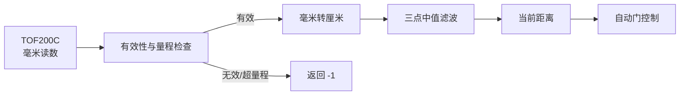

# TOF 测距

> 对应代码：`src/devices/TofSensor.h`、`src/devices/TofSensor.cpp`
> 重建等级：L4（结构与行为重建）

<!-- ==================== 第一部分：给人阅读 ==================== -->

## 总：模块概要（给人阅读）

本模块是自动门的距离感知入口，负责把 TOF200C（VL53L0X）的硬件读数转换成上层可以稳定使用的距离信息。自动门控制器不需要理解 I²C、毫米单位或传感器状态码，只需要读取当前厘米距离和无人环境基线。

### 一次距离数据怎样产生



设备启动或用户重新标定时，模块会在门前无人的条件下采集多次距离，去掉一组明显的最大和最小值后计算环境基线。运行时的当前距离会与这条基线一起交给自动门控制器，用于识别门前是否出现了新的物体或人员。

测距偶尔可能出现无效值，因此模块不会把每次读取都当作可靠结果。无效、超量程或尚未初始化时返回 `-1`，上层会跳过本轮判断；有效数据则经过三点中值滤波，减少单次突变造成误判的概率。

### 接线

| TOF200C | ESP32 |
|---|---|
| VCC | 按模块标称电压供电 |
| GND | GND |
| SDA | GPIO 21 |
| SCL | GPIO 22 |

默认 I²C 地址为 `0x29`。

### 注意事项

- 启动标定时应确保门前无人且没有临时障碍物。
- TOF 初始化失败后系统不会继续驱动自动门，这是硬件安全策略。
- 本模块只提供距离与基线，不判断是否有人，也不决定开关门。

---

<!-- ============== 第二部分：给 AI 和开发者阅读 ============== -->

## 分：代码重建规格（给 AI 或修改代码的开发者阅读）

### 1. 文件映射

- 本模块拥有：`src/devices/TofSensor.h`、`src/devices/TofSensor.cpp`。
- 依赖：Arduino Core 的 `Wire.h`、第三方库 `Adafruit_VL53L0X.h`。
- 被使用：`src/app/AutoDoorApp.h/.cpp`、`src/control/DoorController.h/.cpp`。

### 2. 类和公开接口

头文件 guard 为 `TOF_SENSOR_H`。类名 `TofSensor`。

```cpp
TofSensor();
bool begin(uint8_t sdaPin, uint8_t sclPin,
           uint8_t address, uint16_t maxDistanceMm);
void calibrate();
float readDistance();
void primeFilter();
float getBaseline() const;
```

私有方法为 `readRaw()` 和 `median3(float,float,float)`。

### 3. 成员和初值

- `Adafruit_VL53L0X tof`
- `uint8_t address = 0x29`
- `uint16_t maxDistanceMm = 800`
- `float baseline = -1.0F`
- `float history[3]`：三项均为 `-1.0F`
- `uint8_t historyIndex = 0`
- `bool historyReady = false`
- `bool initialized = false`

### 4. 初始化

`begin()` 保存地址和最大距离，执行 `Wire.begin(sdaPin, sclPin)`，再调用 `tof.begin(address, false, &Wire)`。失败时打印初始化失败和接线提示并返回 false；成功时打印成功日志并返回 true。`AutoDoorApp` 收到 false 后进入每秒 delay 的永久停止循环，禁止在没有测距能力时继续驱动门。

### 5. 原始测距

未初始化时返回 -1。创建 `VL53L0X_RangingMeasurementData_t`，调用 `tof.rangingTest(&measurement, false)`。RangeStatus 等于 4、毫米值为 0 或超过 maxDistanceMm 时返回 -1；否则返回 `RangeMilliMeter / 10.0F` 厘米。RangeStatus 判断遵循用户已验证示例。

### 6. 过滤和标定

有效读数写入三项环形 history；不足三项直接返回当前值，填满后返回三点中值。无效读数不污染窗口。

标定在 5 秒超时内收集最多 10 个有效原始样本，每轮间隔 50ms。超时后按已采集样本数分级处理：≥3 个时去掉最小和最大值取平均；2 个时取均值；1 个时直接用该值；0 个时将 baseline 设为 maxDistanceMm/10.0。随后 `primeFilter()` 持续取得 3 个有效读数，每轮间隔 30ms。标定结束时打印样本数、基线值和结果状态（done/timeout）。

### 7. 异常和约束

- 初始化失败停止应用，这是硬件安全策略。
- 标定超过 5 秒无有效值时会以最大量程兜底并继续运行；预热一直无有效值时会持续等待。
- 单次 `rangingTest` 为同步测量；主循环中不增加示例的 200ms delay。
- 门控阈值和公开距离继续使用厘米。

### 8. 重建验收

- GPIO 21/22、地址 0x29 可初始化 TOF200C。
- 毫米值正确转换为厘米。
- 状态 4、零值和大于 800mm 返回 -1。
- 三点滤波和 10 点去极值标定与本文一致。
- 上层不再包含 `Ultrasonic` 类型或 HC-SR04 引脚。
