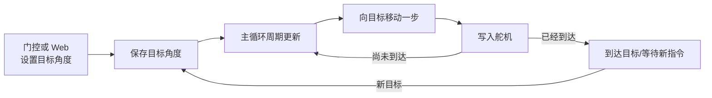

# 舵机控制

> 对应代码：`src/devices/ServoControl.h`、`src/devices/ServoControl.cpp`
> 重建等级：L4（结构与行为重建）

<!-- ==================== 第一部分：给人阅读 ==================== -->

## 总：模块概要（给人阅读）

本模块是自动门的动作执行层。自动门控制器或 Web 服务只需要给出目标角度，舵机模块负责把这个目标逐步转化为真实运动，并持续记录当前已经走到哪里。

### 为什么不是一次转到目标

如果程序用一个长循环等待舵机完成运动，期间测距、网络和网页请求都会受到影响。本模块把运动拆成许多短步骤，每次主循环只前进一步，然后立即把执行权交还给系统。

开门和关门可以使用不同步长，因此能够实现快速打开、相对缓慢关闭等动作特征。外部输入角度会被限制在 0–180 度，但这一软件范围并不能代替真实门体的机械限位。

模块只理解“当前位置”和“目标位置”，不知道系统处于 AUTO 还是 MANUAL，也不决定什么时候应该开关门。运动期间，TOF、BLE、Wi-Fi 和 Web 服务仍可以继续更新。

### 注意事项

- 分步更新不会阻塞主循环，运动期间网络、BLE 和测距仍可继续运行。
- 软件角度限制不能替代真实门体的机械限位和安全验证。
- ESP32-C3 的舵机信号使用 GPIO6；舵机正极接容量足够的独立 5V 电源，负极必须与 ESP32-C3 GND 共地。只有确认开发板 5V 路径和 USB 电源能承受舵机启动电流时，才可临时使用板载 5V。

---

<!-- ============== 第二部分：给 AI 和开发者阅读 ============== -->

## 分：代码重建规格（给 AI 或修改代码的开发者阅读）

### 文件、依赖和接口

头文件使用 include guard `SERVO_CONTROL_H`，包含 `Arduino.h`、`ESP32Servo.h`。声明类 `ServoControl`：构造函数；`begin(uint8_t pin, int initAngle, unsigned long updateInterval, int openStep, int closeStep)`；`update()`；`setTargetAngle(int)`；三个 const 查询 `getTargetAngle()`、`getCurrentAngle()`、`isIdle()`。

私有成员：`Servo servo`、`uint8_t servoPin`、`int currentAngle`、`int targetAngle`、`int openStep`、`int closeStep`、`unsigned long updateInterval`、`unsigned long lastUpdateTime`。

### 初始值与 begin

构造初值依次为：pin 0、当前/目标角度 0、开门步长 30、关门步长 10、间隔 15、上次更新时间 0。`begin()` 保存参数、attach 引脚，把初始角度约束到 0..180，同时赋给当前和目标角度，然后执行一次 `servo.write()`。

### update 算法

读取 `millis()`；未到间隔立即返回，到时先更新时间。已到目标返回。当前小于目标时增加 `openStep`，超过目标则钳制；当前大于目标时减去 `closeStep`，低于目标则钳制；最后写入舵机。

`setTargetAngle()` 把输入约束到 0..180。`isIdle()` 等价于当前角度等于目标角度。

### 不变量与验收

- update 不使用 delay，不一步跨过目标。
- 增大角度使用 openStep，减小角度使用 closeStep。
- 当前目标板的舵机信号引脚为 GPIO6。
- 重建后可用时间推进和角度序列验证：0→90 按 30 递增，90→0 按 10 递减。
