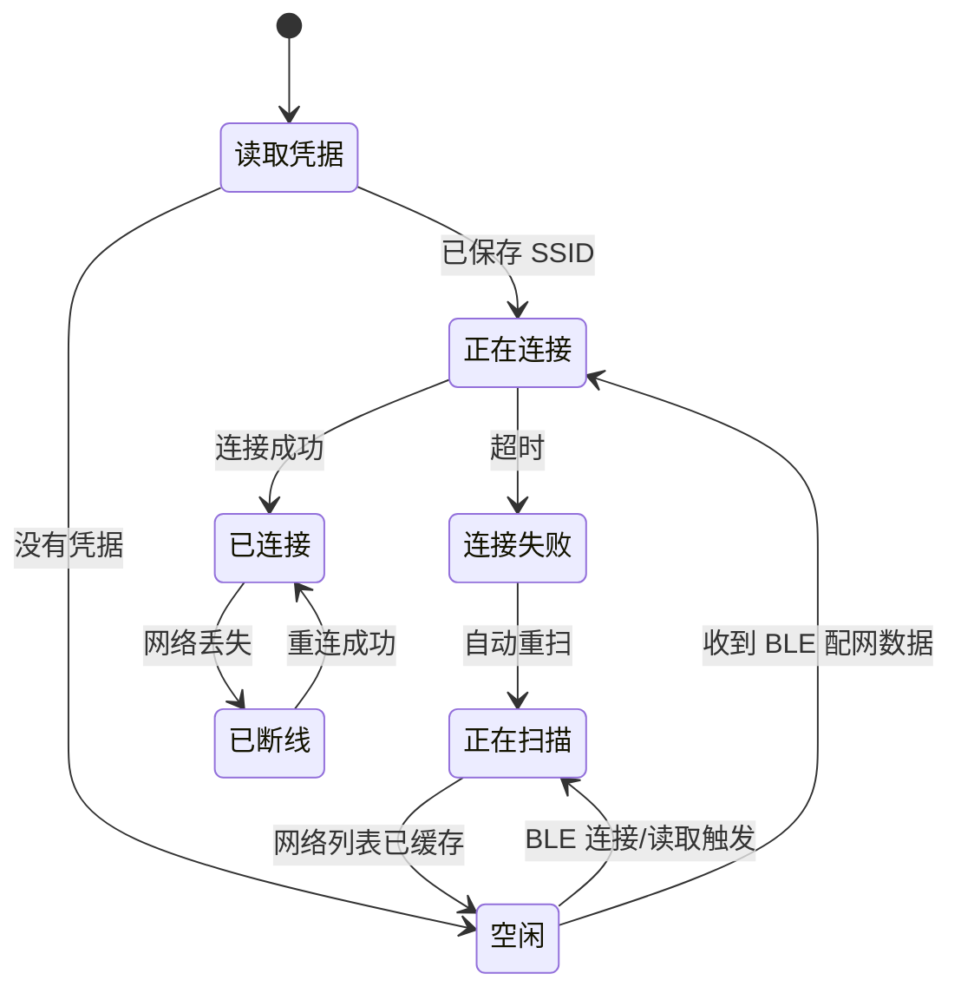

# WiFi 管理

> 对应代码：`src/network/WifiManager.h`、`src/network/WifiManager.cpp`
> 重建等级：L4（结构与行为重建）

<!-- ==================== 第一部分：给人阅读 ==================== -->

## 总：模块概要（给人阅读）

本模块管理 ESP32 加入局域网的完整生命周期。它负责发现附近网络、使用用户提供的凭据建立连接、保存配置供下次启动复用，并在运行期间监测网络是否仍然可用。

### 网络连接的生命周期

设备启动时首先从 NVS 读取以前保存的 SSID 和密码。有凭据时直接尝试连接；没有凭据时扫描附近网络，并把按信号强度排序的列表提供给 BLE 配网模块。后续扫描不再自动定期执行，而是由 BLE 连接或读取事件触发。新配置由系统入口交给本模块保存和连接。

连接成功后，模块向系统提供 IP、RSSI 和连接状态，并启动 `autodoor.local`，让用户不必记住设备 IP。扫描、连接、超时和断线等变化会转换成统一状态，供 BLE 返回手机、供 Web 页面展示。

本模块不解析手机提交的 BLE 数据，也不实现网页或门控逻辑。它只负责让其他模块获得稳定的局域网连接和可观察的网络状态。

### 注意事项

- Wi-Fi 密码只应写入 NVS，不应出现在日志、API 或 BLE 状态中。
- 扫描不再自动定期执行，而是由 BLE 连接/读取事件触发。已连接状态也允许在线扫描附近网络，以便通过 BLE 更换 Wi-Fi；扫描不会主动断开当前连接，但射频扫描期间 HTTP 响应可能短暂变慢。
- 当前连接和扫描恢复流程包含少量阻塞延时，属于现有实现约束。

---

<!-- ============== 第二部分：给 AI 和开发者阅读 ============== -->

## 分：代码重建规格（给 AI 或修改代码的开发者阅读）

### 接口和状态

头文件包含 WiFi、ESPmDNS、Preferences、atomic、vector 和 FreeRTOS semaphore。公开：`begin/update`；连接、IP、RSSI、连接中查询；`tryConnect`、`saveCredentials`；缓存网络、原子扫描快照、索引 SSID、连接状态、一次性状态变化读取和 `startScan()`。私有 `beginScan()` 与 `processScanResult(int)`。

成员依次保存 connected/connecting/scanning，连接和重试时间，缓存字符串、`vector<String> scannedSSIDs`、状态字符串和 statusChanged，最后是原子 scanRequested 与扫描快照互斥锁。`begin()` 创建互斥锁，并显式把运行状态初始化为 false、0 或空。

### 启动与 NVS

设置 `WIFI_STA`，注册事件回调打印事件和断线原因。从 Preferences 命名空间 `wifi` 只读 `ssid`、`pass`。有 SSID 则打印并 `tryConnect`，否则启动扫描。保存时 SSID 空返回 false；写入同名键并只打印 SSID。

### update 状态优先级

1. connecting：连接成功时更新标志、`STATE|CONNECTED|IP`、状态变化并启动 mDNS；超时则断开，依次切换 WIFI_OFF/STA（包含 100/500/500ms delay），设置 `STATE|FAILED|TIMEOUT`，随后调用 startScan() 自动重扫；然后 return。
2. scanning：`scanComplete()` 为 -1 表示未完成；-2 打印失败；其他交给结果处理；return。
3. 未标记 connected 则 return。
4. 实际连接丢失时设置 disconnected 和 `STATE|DISCONNECTED`；达到重连间隔才 `WiFi.reconnect()`。

### 扫描结果

扫描由 BLE 连接/读取事件或连接超时后触发。公开 `startScan()` 只以原子标志登记请求，不得从 BLE 回调直接调用 Wi-Fi 驱动。`update()` 在没有连接和扫描任务时消费请求并调用私有 `beginScan()`，保证扫描启动、结果读取和删除都只发生在 Arduino 主循环任务。已连接时保留当前连接并直接发起在线扫描；扫描进行期间的新请求会在本轮结束后处理。

`beginScan()` 在未连接时先 disconnect 并 delay 200ms；已连接时不执行 disconnect，只打印保留当前连接。然后检查 `scanNetworks(true)` 返回值；只有返回 `WIFI_SCAN_RUNNING` 才设置 scanning、`STATE|SCANNING` 并打印启动成功。`scanComplete()` 返回运行中时不得因为当前仍是 WL_CONNECTED 而中止，因为在线扫描本来就允许保持连接。结果按 RSSI 从强到弱排序；先完整复制到局部字符串和 SSID vector，调用 `scanDelete()` 后再在互斥锁保护下整体替换公开快照，避免 BLE 读取到半更新数据。缓存每行 `显示索引|SSID|中文信号标签`，行间 CRLF，并以同序填充 scannedSSIDs。标签阈值依次为 -30/-40/-50/-60/-70/-80。

结果不大于 0 时保留旧缓存。成功后 `scanDelete()`。

### 连接和一次性状态

`tryConnect` 先设置 connected=false，强制断开、delay 1000，STA、delay 500，关闭省电，调用 begin，设置 connecting 和开始时间，总返回 true。`hasStatusChanged()` 返回当前标志并立即清零。

### 已知约束与验收

- 当前代码包含多处阻塞 delay，文档按真实实现记录。
- 网络缓存索引必须与排序后的 SSID vector 一致。
- `getScanSnapshot()` 必须在同一把互斥锁内复制列表文本与 SSID vector，使一次 BLE Read 得到一致的索引快照。
- 密码只存 NVS，不应在此模块输出。
- Wi-Fi连接摘要受 logWifi 控制；底层事件受 logWifiEvents 控制；扫描生命周期受 logWifiScan 控制；逐热点 SSID/RSSI/信道/认证明细受 logWifiScanDetails 控制。后三类默认关闭，错误继续受 logErrors 控制。
