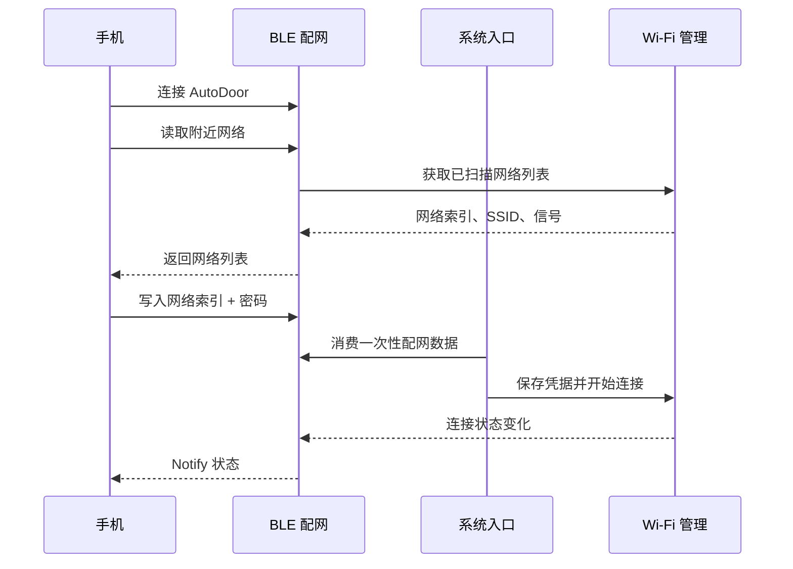

# BLE 配网

> 对应代码：`src/network/BleManager.h`、`src/network/BleManager.cpp`
> 重建等级：L4（结构与行为重建）

<!-- ==================== 第一部分：给人阅读 ==================== -->

## 总：模块概要（给人阅读）

BLE 配网是设备连接局域网之前的临时入口。它解决的问题很直接：自动门第一次上电时还不知道应该连接哪个 Wi-Fi，而用户此时也无法打开设备网页，因此需要通过手机蓝牙把网络信息交给设备。

### 用户第一次配网时会发生什么

1. 用户在手机 BLE 工具中找到并连接 `AutoDoor`。
2. 手机读取 Wi-Fi 列表，看到设备附近可用的网络及信号情况。
3. 用户选择一个网络，提交它在列表中的索引和密码。
4. BLE 模块接收并暂存这份配置，系统入口随后取走它。
5. Wi-Fi 管理模块保存凭据并尝试连接。
6. 正在扫描、正在连接、成功或失败等状态通过 BLE 返回手机。

### BLE 与 Wi-Fi 的分工

BLE 只是手机与设备之间的数据通道，不负责扫描硬件网络、保存凭据或建立 Wi-Fi 连接。附近网络列表和连接状态来自 Wi-Fi 管理模块，系统入口负责把 BLE 收到的配置交给 Wi-Fi 模块处理。

设备正常运行后 BLE 仍保持可用，因此更换路由器时可以重复同样流程，不需要连接 USB 或重新烧录固件。手机断开连接后，设备会重新开始广播，等待下一次操作。

> 安全提示：当前调试日志会输出包含 Wi-Fi 密码的原始配网数据，这是已知缺陷，不代表期望设计。在修复前，不应向不可信人员开放串口日志。

---

<!-- ============== 第二部分：给 AI 和开发者阅读 ============== -->

## 分：代码重建规格（给 AI 或修改代码的开发者阅读）

### 类结构

`BleManager` 同时继承 `NimBLEServerCallbacks` 和 `NimBLECharacteristicCallbacks`。公开：构造、六参数 begin、update、isConnected、isBleMode、stop、`hasWiFiConfig(int&,String&)`。覆盖 onConnect、onDisconnect、onRead、onWrite；私有 parseWiFiConfig。

成员包括 server/service/两个 characteristic/WifiManager 指针；volatile connected、bleMode、newWiFiConfig；configIndex 和 configPassword。构造时指针 null、布尔 false、索引 -1。

### 服务创建

初始化设备名，功率 P9，MTU 256；创建 server/service。WiFiScan 特征仅 READ；WiFiConfig 为 WRITE|NOTIFY；两者回调均为 this。启动服务，广告加入 service UUID、名称和 scan response，开始广播。

### 回调和协议

- 连接：connected/bleMode=true。
- 断开：两者 false，打印 reason，重新广播。
- Read：仅 WiFiScan 生效；缓存为空返回中文“扫描中”提示，否则返回中文输入提示加网络列表。
- Write：空值返回；当前实现逐字符打印完整收到的数据，再对 WiFiConfig 解析。
- 解析：trim，找到第一个 `+`；没有则报错。前段 `toInt()` 为索引，后段 trim 为密码，设置 newWiFiConfig。
- `hasWiFiConfig` 是一次性消费：有值时复制索引和密码并清零标志。

### 状态通知

`update()` 仅在 wifi 存在、状态发生变化且 BLE 已连接时读取状态；characteristic 存在则 setValue、notify 并打印。未连接时调用 `hasStatusChanged()` 的短路会保留 WifiManager 标志。

### 当前安全问题和重建要求

当前 `onWrite` 和解析日志会输出包含 Wi-Fi 密码的原文，这是已识别风险，不应被当作理想设计。若严格重建当前代码需保持行为；正常维护应另行修复并同步本文。其余重建需保持 UUID 由调用者注入、属性、协议分隔方式和一次性消费语义。
