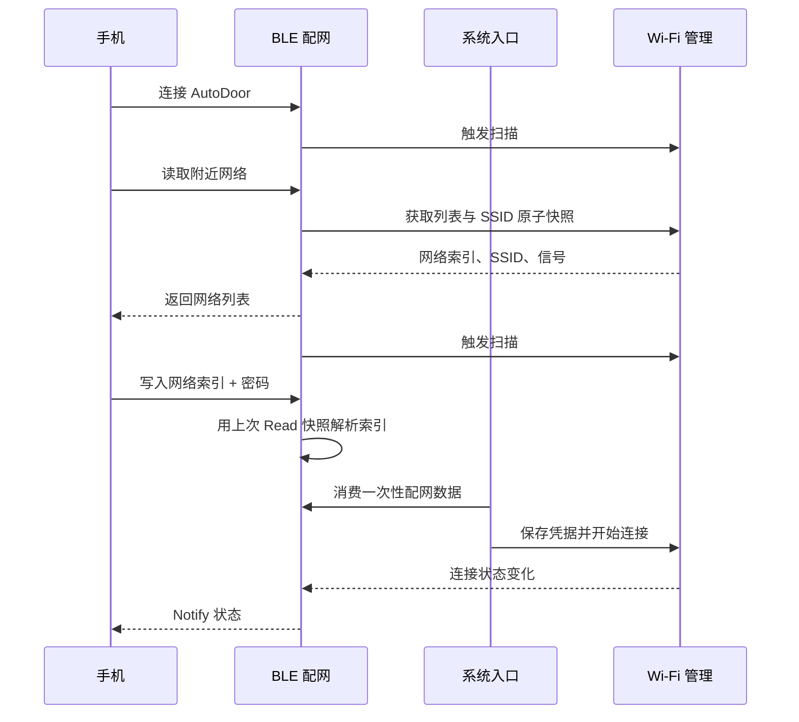

# BLE 配网

> 对应代码：`src/network/BleManager.h`、`src/network/BleManager.cpp`
> 重建等级：L4（结构与行为重建）

<!-- ==================== 第一部分：给人阅读 ==================== -->

## 总：模块概要（给人阅读）

BLE 配网是设备连接局域网之前的临时入口。它解决的问题很直接：自动门第一次上电时还不知道应该连接哪个 Wi-Fi，而用户此时也无法打开设备网页，因此需要通过手机蓝牙把网络信息交给设备。

### 用户第一次配网时会发生什么

1. 用户在手机 BLE 工具中找到并连接 `AutoDoor`（连接时设备会自动扫描一次附近 Wi-Fi）。
2. 手机读取 Wi-Fi 列表，看到设备附近可用的网络及信号情况；设备冻结本次返回列表的索引映射，并请求在后台重新扫描一次。
3. 用户选择一个网络，提交它在列表中的索引和密码。
4. BLE 模块接收并暂存这份配置，系统入口随后取走它。
5. Wi-Fi 管理模块保存凭据并尝试连接。
6. 正在扫描、正在连接、成功或失败等状态通过 BLE 返回手机。

### BLE 与 Wi-Fi 的分工

BLE 只是手机与设备之间的数据通道，不负责扫描硬件网络、保存凭据或建立 Wi-Fi 连接。附近网络列表和连接状态来自 Wi-Fi 管理模块，系统入口负责把 BLE 收到的配置交给 Wi-Fi 模块处理。

设备正常运行后 BLE 仍保持可用，因此更换路由器时可以重复同样流程，不需要连接 USB 或重新烧录固件。切换 Wi-Fi 时直接调用 tryConnect() 断旧连新，无需重启。手机断开连接后，设备会重新开始广播，等待下一次操作。

> 安全提示：按当前调试要求，串口会输出包含 Wi-Fi 密码的原始配网数据和解析结果。不应向不可信人员开放串口日志，发布版本应重新评估并关闭该输出。

---

<!-- ============== 第二部分：给 AI 和开发者阅读 ============== -->

## 分：代码重建规格（给 AI 或修改代码的开发者阅读）

### 类结构

`BleManager` 同时继承 `NimBLEServerCallbacks` 和 `NimBLECharacteristicCallbacks`。公开：构造、六参数 begin、update、isConnected、isBleMode、stop、`hasWiFiConfig(int&,String&,String&)`。覆盖 onConnect、onDisconnect、onRead、onWrite；私有 parseWiFiConfig。

成员包括 server/service/两个 characteristic/WifiManager 指针；volatile connected、bleMode；原子的 newWiFiConfig；configIndex、configSSID、configPassword，以及保存上次 Read 索引映射的 `selectionSSIDs`。构造时指针 null、布尔 false、索引 -1。

### 服务创建

初始化设备名，功率 P9，MTU 256；创建 server/service。WiFiScan 特征仅 READ；WiFiConfig 为 WRITE|NOTIFY；两者回调均为 this。启动服务，广告加入 service UUID、名称和 scan response，开始广播。

### 回调和协议

- 连接：connected/bleMode=true，随后调用 wifi->startScan() 排队一次 Wi-Fi 扫描请求；即使当前 Wi-Fi 已连接也执行在线扫描，但不主动断开当前网络。回调中不直接操作 Wi-Fi 驱动。
- 断开：两者 false，打印 reason，重新广播。
- Read：仅 WiFiScan 生效；通过 `getScanSnapshot()` 同时复制缓存文本和 SSID vector，并把 vector 保存为本次选择快照。缓存为空返回中文“扫描中”提示，否则返回中文输入提示加网络列表；返回结果后调用 startScan() 排队一次后台扫描。BLE Read 是同步响应，当前这次返回已完成的最近快照，后台扫描完成后的新列表由下一次 Read 取得。
- Write：空值返回；当前实现逐字符打印完整收到的数据，再对 WiFiConfig 解析。
- 解析：trim，找到第一个 `+`；没有则报错。前段 `toInt()` 为索引，后段 trim 为密码；继续用上次 Read 冻结的 `selectionSSIDs` 解析 configSSID，越界则保存空 SSID 并打印错误。原始 RX 以及 index/pass 解析结果均打印到串口，最后以 release 语义设置 newWiFiConfig。
- `hasWiFiConfig(int&, String&, String&)` 是一次性消费：以 acquire 语义清零标志，并复制索引、已冻结 SSID 和密码。

### 状态通知

`update()` 仅在 wifi 存在、状态发生变化且 BLE 已连接时读取状态；characteristic 存在则 setValue、notify 并打印。未连接时调用 `hasStatusChanged()` 的短路会保留 WifiManager 标志。

### 当前安全问题和重建要求

当前 `onWrite` 和解析日志按调试要求输出包含 Wi-Fi 密码的原文，这是明确的安全风险。重建当前代码需保持该行为，发布前应另行确认是否删除并同步本文。其余重建需保持 UUID 由调用者注入、属性、`索引+密码` 协议、上次 Read 快照解析和一次性消费语义。
