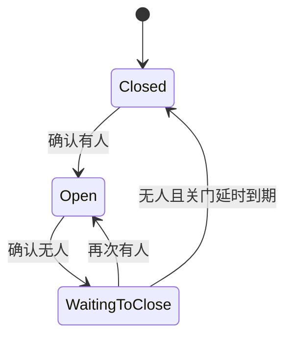

# 自动门控制

> 对应代码：`src/control/DoorController.h`、`src/control/DoorController.cpp`
> 重建等级：L4（结构与行为重建）

<!-- ==================== 第一部分：给人阅读 ==================== -->

## 总：模块概要（给人阅读）

本模块是自动门的决策中心。它接收 TOF 模块提供的距离，判断门前是否有人，再决定应该打开、继续保持还是等待关门。它不会直接访问传感器总线，也不会自己输出舵机信号，而是把最终目标交给舵机控制模块执行。

### 一个人经过门前时会发生什么

1. 门前无人时，TOF 测得的距离接近启动时记录的环境基线。
2. 人走近后，当前距离缩短，系统得到“基线减去当前距离”的变化量。
3. 变化量需要持续达到阈值一段时间，系统才确认有人，避免一次读数波动导致误开门。
4. 确认有人后，门进入 `Open`，舵机收到开门目标。
5. 人离开后，系统先保留一段驻留时间，再进入等待关门。
6. 等待期间如果有人再次出现，关门立即取消，门重新保持打开。
7. 持续无人并达到关门延时后，舵机才收到关闭目标。

### 门状态怎样变化



- `Closed` 表示门处于关闭状态，等待人员接近。
- `Open` 表示门已打开或正在保持打开。
- `WaitingToClose` 表示已经确认无人，但仍处于安全等待阶段。

### AUTO 与 MANUAL

AUTO 模式下，本模块持续读取距离并推进上述状态。MANUAL 模式下，自动测距判断和状态机完全暂停，网页可以直接设置舵机目标角度。切换模式并不会改变模块之间的职责：Web 服务只发出模式或角度请求，真正的自动决策仍集中在这里。

### 它在系统中的位置

```text
TOF 测距 → 当前距离与基线 → 自动门控制 → 目标角度 → 舵机控制
                                  ↓
                         Web 状态与调试日志
```

这样划分的目的，是让感知、决策和执行保持独立。以后更换传感器或调整网页时，门状态机不需要跟着搬到其他模块。

---

<!-- ============== 第二部分：给 AI 和开发者阅读 ============== -->

## 分：代码重建规格（给 AI 或修改代码的开发者阅读）

### 文件与接口

头文件 guard `DOOR_CONTROLLER_H`，包含 Arduino、TofSensor、ServoControl、Config。公开：构造函数、`begin(TofSensor*,ServoControl*)`、`update()`、距离/baseline/diff/detect/present/door state 查询、`setManualMode(bool)`、`isManualMode()`、`triggerCalibrate()`。私有：`updateAutoMode(unsigned long)`、`setDoorOpen()`、`setDoorClose()`。

成员：`TofSensor *distanceSensor` 和 `ServoControl *servo`；DoorState；baseline；lastSeenTime、closeStartTime；manualMode；detecting、detectStartTime；currentDistance、currentDiff、currentDetect、currentPresent、lastPrintTime。

构造初值：指针 null，Closed，baseline 0，全部时间 0，布尔 false，currentDistance -1，diff 0。

### 初始化和更新

`begin()` 保存指针，从传感器复制 baseline；重置 Closed、时间、manual 和检测状态；舵机目标设为关闭角度。`update()` 在 manualMode 时直接返回，否则调用 `updateAutoMode(millis())`。

### 人员检测

读取滤波距离并保存。负值立即返回，其他当前字段保持此前值。`diff = baseline - d`；`detect = diff >= changeThresholdCm`。detect 首次出现时记录 detectStartTime；连续达到 detectionDebounceMs 后每轮更新 lastSeenTime；不 detect 时清除 detecting。`isPresent = now-lastSeenTime < presenceTimeoutMs`。

### 状态机

| 当前 | 条件 | 动作 | 下一状态 |
|---|---|---|---|
| Closed | present | 目标=openAngle | Open |
| Open | !present | closeStartTime=now | WaitingToClose |
| WaitingToClose | present | 无 | Open |
| WaitingToClose | !present 且等待达到 closeDelayMs | 目标=closedAngle | Closed |

### 标定和日志

`triggerCalibrate()` 同步调用传感器标定，刷新 baseline，状态设 Closed，detecting=false；当前实现不主动设置舵机关闭。调试开关开启时每隔 printIntervalMs 打印距离、baseline、diff、detect、present、状态字符串和舵机角度。

### 不变量与验收

- Manual 必须完全跳过自动读取和状态机。
- 无效距离不推进检测与状态。
- 等待关门期间重新有人必须恢复 Open。
- 重建应以可控距离和时间序列复现所有状态转换。
