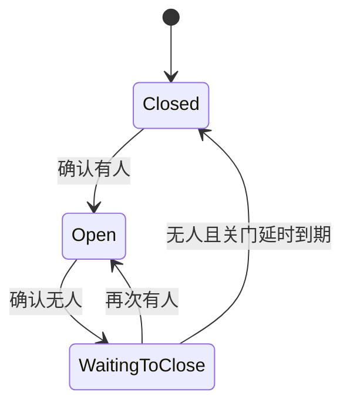

# 自动门控制

> 对应代码：`src/control/DoorController.h`、`src/control/DoorController.cpp`
> 重建等级：L4（结构与行为重建）

<!-- ==================== 第一部分：给人阅读 ==================== -->

## 总：模块概要（给人阅读）

本模块是自动门的决策中心。它接收 TOF 模块提供的距离，判断门前是否有人，再决定应该打开、继续保持还是等待关门。它不会直接访问传感器总线，也不会自己输出舵机信号，而是把最终目标交给舵机控制模块执行。

自动门属于本地功能，不依赖 Wi-Fi、BLE 客户端或 Web 页面是否可用。系统处于等待 BLE 配网的 Configuring 状态时，本模块仍在每轮主循环中运行。

### 一个人经过门前时会发生什么

1. 门前无人时，TOF 测得的距离接近启动时记录的环境基线。
2. 人走近后，当前距离缩短，系统得到“基线减去当前距离”的变化量。
3. 变化量需要持续达到阈值一段时间，系统才确认有人，避免一次读数波动导致误开门。
4. 确认有人后，门进入 `Open`，舵机收到开门目标。
5. 人离开后，系统先保留一段驻留时间，再进入等待关门。
6. 等待期间如果有人再次出现，关门立即取消，门重新保持打开。
7. 持续无人并达到关门延时后，舵机才收到关闭目标。

### 门状态怎样变化



- `Closed` 表示门处于关闭状态，等待人员接近。
- `Open` 表示门已打开或正在保持打开。
- `WaitingToClose` 表示已经确认无人，但仍处于安全等待阶段。

### AUTO 与 MANUAL

AUTO 模式下，本模块持续读取距离并推进上述状态。MANUAL 模式下，自动测距判断和状态机完全暂停，网页可以直接设置舵机目标角度。切换模式并不会改变模块之间的职责：Web 服务只发出模式或角度请求，真正的自动决策仍集中在这里。

初始关闭角度、相对转动角度和触发距离差是可持久化运行参数，可在 MANUAL 的网页输入框直接查看和编辑。AUTO 开门目标等于“初始角度 + 相对转动角度”；保存时要求初始角和计算后的开门角都在 0～180°，不允许靠静默钳制缩短实际转角。相对角度允许正负值，以适配两种安装方向。

首次运行没有 NVS 设置时使用初始角 0°、相对转角 +90°、开门角 90°。这里的“初始角”是软件配置和上电命令，不是从普通三线舵机读取的真实位置；已有网页保存值始终优先。

### 它在系统中的位置

```text
TOF 测距 → 当前距离与基线 → 自动门控制 → 目标角度 → 舵机控制
                                  ↓
                         Web 状态与调试日志
```

这样划分的目的，是让感知、决策和执行保持独立。以后更换传感器或调整网页时，门状态机不需要跟着搬到其他模块。

---

<!-- ============== 第二部分：给 AI 和开发者阅读 ============== -->

## 分：代码重建规格（给 AI 或修改代码的开发者阅读）

### 文件与接口

头文件 guard `DOOR_CONTROLLER_H`，包含 Arduino、Preferences、TofSensor、ServoControl、Config。公开接口另含 `saveRuntimeSettings(initial,rotation,threshold)` 和 initial/rotation/open/threshold 四个查询。私有：`updateAutoMode(unsigned long)`、`setDoorOpen()`、`setDoorClose()`。

成员在 baseline 后增加 initialAngle、rotationAngle、distanceThresholdCm；其余为 lastSeenTime、closeStartTime、manualMode、detecting、detectStartTime、currentDistance、currentDiff、currentDetect、currentPresent、lastPrintTime。

构造初值：指针 null，Closed，baseline 0，全部时间 0，布尔 false，currentDistance -1，diff 0。

### 初始化和更新

`loadRuntimeSettings()` 从 Preferences 命名空间 `doorcfg` 读取 `initial`、`rotation`、`threshold`；缺失时分别使用 Config 的 closedAngle、openAngle-closedAngle、changeThresholdCm。初始角限制 0..180，相对角限制 -180..180，阈值超出 0.1..200cm 时恢复默认。系统入口必须在舵机 attach 前调用它。`begin()` 保存传感器/舵机指针和 baseline、重置状态，并把舵机目标保持为 initialAngle。

### 人员检测

读取滤波距离并保存。负值立即返回。`diff = baseline - d`；`detect = diff >= distanceThresholdCm`，不再直接读取编译期阈值。

### 状态机

| 当前 | 条件 | 动作 | 下一状态 |
|---|---|---|---|
| Closed | present | 目标=constrain(initialAngle+rotationAngle,0,180) | Open |
| Open | !present | closeStartTime=now | WaitingToClose |
| WaitingToClose | present | 无 | Open |
| WaitingToClose | !present 且等待达到 closeDelayMs | 目标=initialAngle | Closed |

### 运行参数保存

`saveRuntimeSettings()` 只在 MANUAL 接受调用，校验 initial 0..180、rotation -180..180、initial+rotation 0..180、threshold 0.1..200；任一越界整体拒绝。成功后更新成员、重置为 Closed、清除检测/人员状态、舵机移动到 initial，并把三项写入 `doorcfg`。加载旧 NVS 时若组合越界，只把 rotation 收缩到当前 initial 允许的边界；open 查询仍保留 0..180 防御性钳制。

### 标定和日志

`triggerCalibrate()` 同步调用传感器标定，刷新 baseline，状态设 Closed，detecting=false；当前实现不主动设置舵机关闭。`Config::Debug::logDoor` 开启时每隔 printIntervalMs 打印距离、baseline、diff、detect、present、状态字符串和舵机角度，默认关闭以避免串口刷屏。

### 不变量与验收

- Manual 必须完全跳过自动读取和状态机。
- 真正无效的负距离不推进检测与状态；TOF 的无目标/超量程结果必须由传感器模块转换为最大距离，而不能作为负值传入，否则人员离开后状态机会停在 Open。
- Wi-Fi 未配置、连接失败或断开时仍必须持续调用本模块；网络状态不得阻断本地自动开关门。
- 启动朝向天空导致基线以最大量程兜底时，后续目标进入有效量程后应从第一条有效距离开始恢复检测，不要求重新启动或先连接 Wi-Fi。
- 等待关门期间重新有人必须恢复 Open。
- 重建应以可控距离和时间序列复现所有状态转换。
