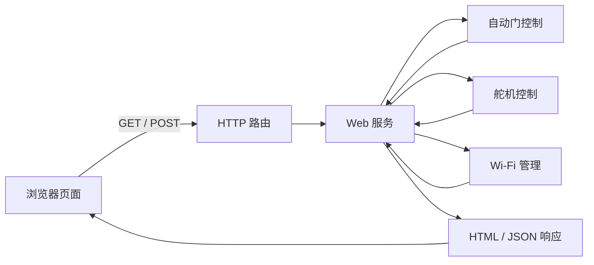

# Web 服务

> 对应代码：`src/web/WebServerManager.h`、`src/web/WebServerManager.cpp`
> 重建等级：L4（结构与行为重建）

<!-- ==================== 第一部分：给人阅读 ==================== -->

## 总：模块概要（给人阅读）

本模块位于浏览器页面与设备内部功能之间。页面只能发送 HTTP 请求，门控、舵机和网络模块只提供 C++ 接口；Web 服务负责在两者之间转换请求、调用能力并组织响应。

### 一次请求怎样进入系统

访问根路径时，服务返回嵌入固件的控制页面；查询状态时，它从门控、舵机和 Wi-Fi 模块收集信息并组成 JSON；收到操作请求时，则把模式、角度或标定指令交给对应模块。

### 当前对外能力

| 能力 | 方法和路径 | 作用 |
|---|---|---|
| 控制页面 | `GET /` | 返回嵌入式 Web 页面 |
| 状态查询 | `GET /api/status` | 返回距离、门控、舵机和网络状态 |
| 舵机控制 | `GET /api/servo` | 设置目标角度 |
| 模式切换 | `POST /api/mode` | 切换 AUTO/MANUAL |
| 环境标定 | `POST /api/calibrate` | 重新测量 TOF 环境基线 |

Web 服务只做协议适配，不判断是否有人、不实现门状态机，也不直接操作传感器或舵机 PWM。使用异步服务器可以避免普通 HTTP 连接长期占用主循环，但重新标定仍会等待传感器完成采样。

### 注意事项

- 接口没有登录认证、加密和 CSRF 防护，只适合可信局域网。

---

<!-- ============== 第二部分：给 AI 和开发者阅读 ============== -->

## 分：代码重建规格（给 AI 或修改代码的开发者阅读）

### 类结构和初始化

头文件包含 ESPAsyncWebServer、DoorController、ServoControl、WifiManager。公开构造和 `begin`。私有保存 server 与三个依赖指针，声明路由处理器、`buildStatusJson()`、`doorStateToString()`。构造全部指针 null。begin 保存依赖，以 `Config::Network::webPort` new AsyncWebServer，注册路由并 begin。

### 路由契约

| 方法 | 路径 | 行为 |
|---|---|---|
| GET | `/` | `send_P(200,"text/html",INDEX_HTML)` |
| GET | `/api/status` | 返回 buildStatusJson |
| GET | `/api/servo?angle=N` | 缺参 400；toInt 后钳制 0..180，设置目标，返回 ok |
| POST | `/api/mode` | body 含 `manual` 即 manual，否则 auto，返回 ok |
| POST | `/api/calibrate` | 同步标定，返回 ok 和两位小数 baseline |

mode body 回调按本次 `data,len` 构造 String，当前不处理分片 index/total。

### 状态 JSON

字段顺序和来源：distance、baseline、diff、detect、present、door、servo、mode、wifi、ip、rssi。前三个浮点为两位小数；door 映射 Closed→CLOSED、Open→OPEN、WaitingToClose→WAIT_CLOSE、默认 UNKNOWN；mode 为 MANUAL/AUTO。

### 约束与验收

- Web 不自行执行门状态机。
- 当前没有认证和 CSRF 保护。
- 重新标定是同步阻塞请求。
- 重建后路由、方法、字段、状态码和字符串必须一致。
